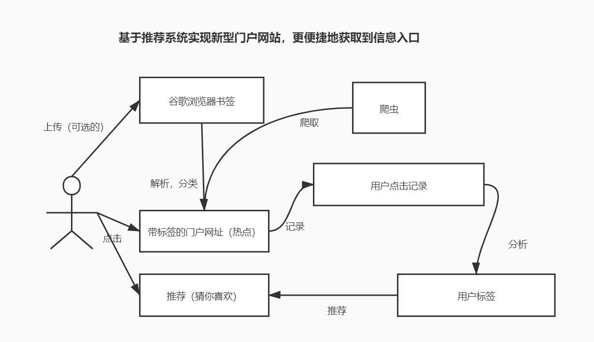

# BookmarkSharer
> 从谷歌浏览器导出书签，共享到本站，通过我们的分类、推荐算法共同构建一个门户网站！
- 流程图说明

# 项目结构说明
- BookmarkSharer 源码目录
    - bookmark 谷歌浏览器书签目录
    - BookmarkSharer Django 项目
    - sharer Django 实战应用（数据库配置等敏感信息已去除）
- learn 学习笔记目录
- push.sh 快捷提交脚本

# 学习Python，爱上Python！
## 学习计划
1. [熟悉Python语法](learn/learnPython.md)
2. [快速入门 Django](learn/quickStartDjango.md)
3. [系统学习 Django](learn/learnDjango.md)
4. 熟悉Python数据分析